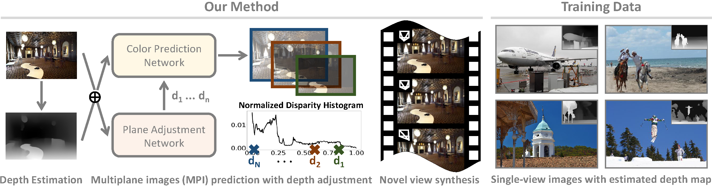

# AdaMPI

This is a PyTorch implementation of the following paper:

**Single-View View Synthesis in the Wild with Learned Adaptive Multiplane Images**, SIGGRAPH 2022.

Yuxuan Han, Ruicheng Wang and Jiaolong Yang

[Project Page](https://yxuhan.github.io/AdaMPI/index.html) | [Video](https://www.youtube.com/watch?v=1tzYr8dp0oY) | [Paper](https://arxiv.org/abs/2205.11733)

**Abstract**: *This paper deals with the challenging task of synthesizing novel views for in-the-wild photographs. Existing methods have shown promising results leveraging monocular depth estimation and color inpainting with layered depth representations. However, these methods still have limited capability to handle scenes with complex 3D geometry. We propose a new method based on the multiplane image (MPI) representation. To accommodate diverse scene layouts in the wild and tackle the difficulty in producing high-dimensional MPI contents, we design a network structure that consists of two novel modules, one for plane depth adjustment and another for depth-aware color prediction. The former adjusts the initial plane positions using the RGBD context feature and an attention mechanism. Given adjusted depth values, the latter predicts the color and density for each plane separately with proper inter-plane interactions achieved via a feature masking strategy. To train our method, we construct large-scale stereo training data using only unconstrained single-view image collections by a simple yet effective warp-back strategy.*

**Code comming soon!**

## Contact
If you have any questions, please contact Yuxuan Han (hanyuxuan076@gmail.com).

## Citation
Please cite the following paper if this model helps your research:

    @inproceedings{han2022single,
        author = {Han, Yuxuan and Wang, Ruicheng and Yang, Jiaolong},
        title = {Single-View View Synthesis in the Wild with Learned Adaptive Multiplane Images},
        booktitle = {ACM SIGGRAPH},
        year={2022}
    }

